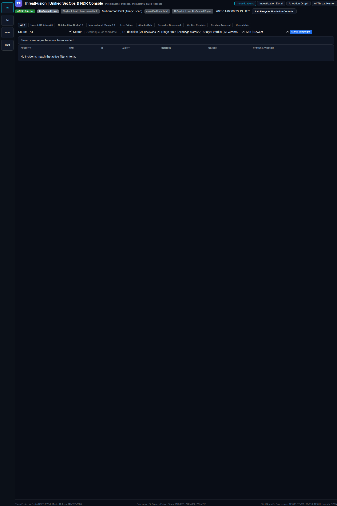
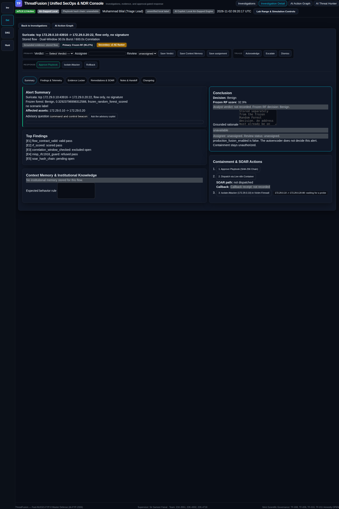
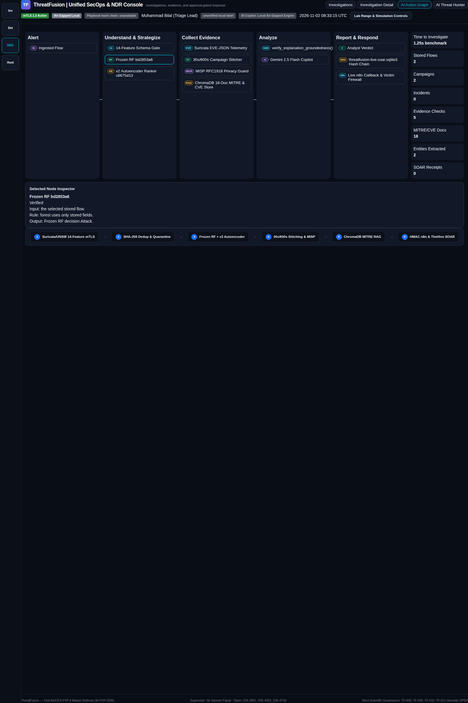
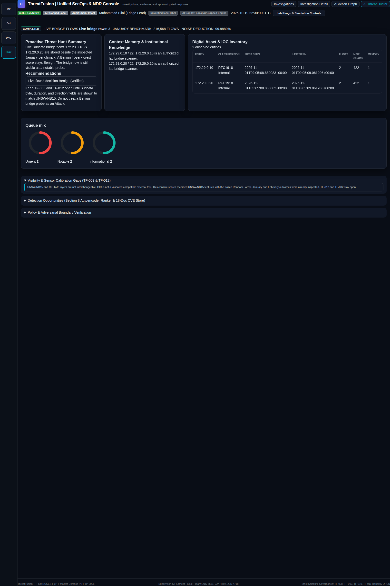
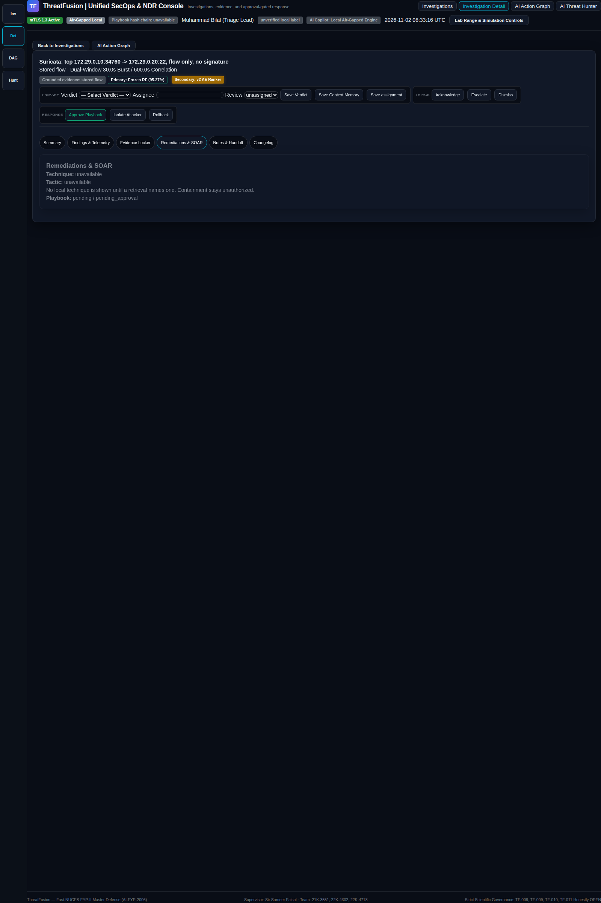
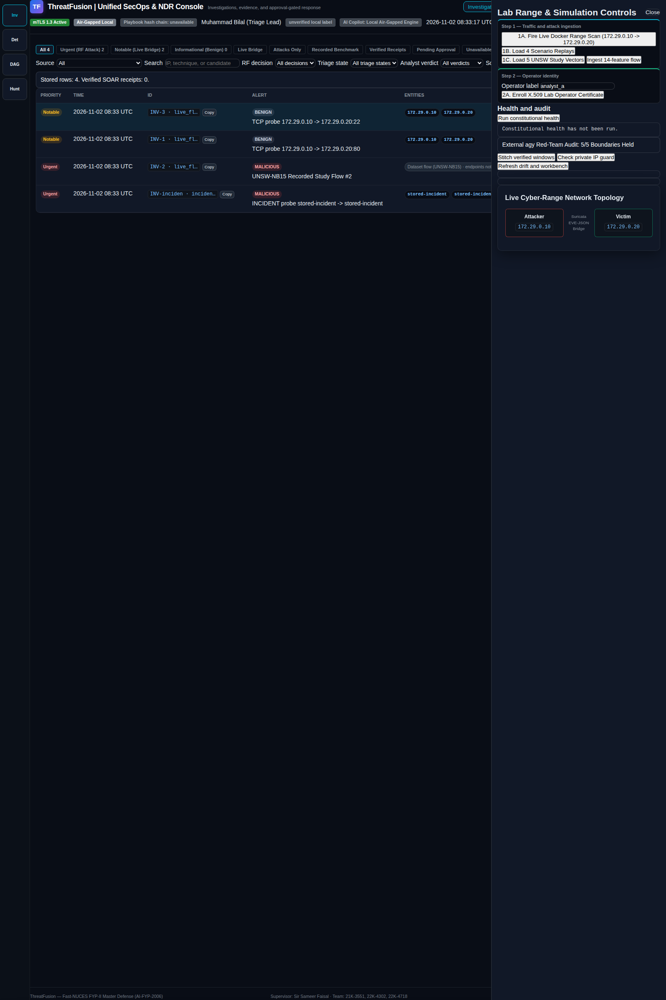
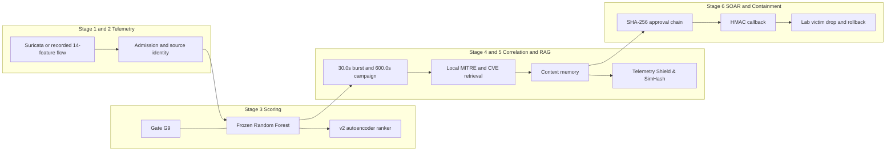

<div align="center">

# 🛡️ ThreatFusion

**Deterministic-First AI Security Operations Center (SOC) — Mitigating Alert Fatigue in Security Operations through a Unified Threat Intelligence and Analytics Interface**

[](https://www.python.org/)
[](https://ubuntu.com/)
[](LICENSE)
[](#section-8-benchmark)
[](#analyst-workflow)
[](#read-only-model-context-protocol-mcp-server)
[](https://github.com/bilaldevsec/Threatfusion/actions/workflows/backend-quality.yml)
[](#gate-g9--boundary-preflight)

[Product tour](#product-tour) · [Architecture](#architecture) · [MCP server](#read-only-model-context-protocol-mcp-server) · [Telemetry shield](#telemetry-shield--evidence-fence) · [Quickstart](#quickstart) · [Analyst workflow](#analyst-workflow) · [Section 8 benchmark](#section-8-benchmark) · [Verification & testing](#verification--testing) · [Governance](#governance) · [Acknowledgments](#acknowledgments)

</div>

ThreatFusion is a local security operations console. A frozen Random Forest is the only alert authority. Analysts record a separate verdict, assign a case, and approve a response. The autoencoder does not change the alert decision. Host containment stays unauthorized.

## Executive summary

- **Sole alert authority.** The frozen Random Forest scores each 14-feature flow. `production_fusion_enabled = False`.
- **Secondary v2 autoencoder ranker.** The autoencoder can order a queue. It does not change the forest decision.
- **Institutional context memory.** A grounded analyst verdict remembers an entity rule beside the score. The forest probability stays as stored.
- **Cryptographic SOAR ledger.** Approval is an HMAC-SHA256 keyed hash chain. Dispatch records an HMAC callback. Containment of `172.29.0.10` runs only inside the lab victim after that chain and callback.
- **Read-Only Model Context Protocol (MCP) Server.** Standardized JSON-RPC 2.0 interface for AI assistants with strict programmatic containment blocks.
- **Stage-5 Telemetry Shield & Evidence Fence.** 64-bit SimHash burst compression and prompt injection mitigation to secure LLM forensic reasoning.

## Product tour

The console is four full-screen views. Simulation controls stay in the lab drawer.

### Active Investigations Queue

Stored rows, source filters, and the frozen-forest decision.



### Investigation Detail and Evidence Locker

Sensor line, forest score, and the three stored SQL queries.



### AI Action Graph and 5-column DAG

Alert, understand, collect, analyze, and respond.



### AI Threat Hunter and asset telemetry

Queue mix and the digital asset inventory.



### SOAR containment and reversible firewall drop

Lab drop of `172.29.0.10` inside the victim namespace, then rollback.



### Adversarial red-team audit

Five refusal probes against an isolated temporary database.



## Architecture

One process on `127.0.0.1` serves the console and the contract routes. `scripts/run_live_product.sh` starts that process, waits for `GET /` and `GET /healthz`, and stops it on Ctrl-C or `SIGTERM`.


```mermaid
flowchart LR
  subgraph stage12 [Stage 1 and 2 Telemetry]
    sensor[Suricata or recorded 14-feature flow]
    mtls[Admission and source identity]
  end
  subgraph stage3 [Stage 3 Scoring]
    forest[Frozen Random Forest]
    gate[Gate G9]
    ae[v2 autoencoder ranker]
  end
  subgraph stage45 [Stage 4 and 5 Correlation and RAG]
    stitch["30.0s burst and 600.0s campaign"]
    rag[Local MITRE and CVE retrieval]
    memory[Context memory]
    shield[Telemetry Shield & SimHash]
  end
  subgraph stage6 [Stage 6 SOAR and Containment]
    chain[SHA-256 approval chain]
    callback[HMAC callback]
    lab[Lab victim drop and rollback]
  end
  sensor --> mtls --> forest
  gate --- forest
  forest --> ae
  forest --> stitch --> rag --> memory --> shield
  memory --> chain --> callback --> lab
```

`production_fusion_enabled = False`. The autoencoder does not decide the alert. Host containment stays unauthorized until an analyst approves a hash-chained playbook and a callback is recorded. The lab drop still does not mark `containment_executed` on the approval route.

```text
Recorded 14-feature flow
  -> frozen Random Forest decision
  -> SQLite queue with live counts
  -> analyst verdict, rationale, assignee, and review status
  -> glass-box checklist from stored fields
  -> correlation of Attack rows that share a verified entity key
  -> grounded shift handoff
  -> hash-chained approval, verify-state, and HMAC callback
```

Approval, verify-state, and the callback share one ledger file. A missing ledger fails closed.

### Gate G9 & Boundary Preflight

ThreatFusion enforces architectural decoupling via **Gate G9**:
- **0 Advisory Decision Writes:** Advisory components (`threatfusion.advisory.*`), the Telemetry Shield, and the MCP server strictly observe telemetry and generate draft rules; they are programmatically barred from writing alert decisions or modifying forest probabilities.
- **Deterministic Boundary Preflight:** Automated by `scripts/boundary_preflight.py`, checking 7 distinct isolation boundaries (`B0` through `B6`):
  * **B0:** Workspace non-overlap.
  * **B1:** Current Working Directory containment.
  * **B2:** Workspace symlink non-escape check.
  * **B3:** Virtualenv configuration and symlink isolation.
  * **B4:** Git repository metadata (`.git`) boundary isolation.
  * **B5:** Runtime code and configuration non-leakage.
  * **B6:** Runtime import path isolation (`PYTHONPATH`, `sys.path`).

Run boundary verification:
```bash
threatfusion-venv/bin/python3 scripts/boundary_preflight.py
```

---

## Read-Only Model Context Protocol (MCP) Server

ThreatFusion provides a native Model Context Protocol (MCP) server implemented in `scripts/threatfusion_mcp_server.py`. The server exposes a JSON-RPC 2.0 transport over stdio, enabling external AI agents and coding tools (such as OpenAI Codex, Claude, or local assistants) to inspect security telemetry without bypassing human-in-the-loop authorization gates.

### Available Read-Only Tools

1. `threatfusion_list_queue`: Lists prioritized active incidents with scores from the Frozen Random Forest, Autoencoder, 9-Class DNN, and burst counts.
2. `threatfusion_get_incident`: Retrieves complete forensic telemetry, stored feature vectors, and MITRE/CVE context for a given `flow_id`.
3. `threatfusion_get_advisory_trace`: Inspects Gate G9 compliance proof, confirms zero advisory decision writes, and retrieves the Evidence Fence digest and Ledger Verification state.
4. `threatfusion_draft_detection_rule`: Drafts review-only Suricata and Sigma rules for an investigated incident or threat query.

### Safety Guarantee: Containment Hard-Block
The MCP server enforces a strict programmatic deny-list against destructive actions:
- `threatfusion_approve`, `threatfusion_dispatch`, `threatfusion_isolate`, `threatfusion_rollback`, and `contain` are hard-blocked at the schema and handler layers. Containment actions remain strictly reserved for authorized human analysts via the signed HMAC ledger.

### Starting the MCP Server
```bash
threatfusion-venv/bin/python3 scripts/threatfusion_mcp_server.py
```

---

## Telemetry Shield & Evidence Fence

The Stage-5 Telemetry Shield (`backend/src/threatfusion/advisory/telemetry_shield.py`) hardens LLM advisory operations against telemetry floods and prompt injection attacks:

1. **64-bit SimHash Burst Compression:**
   - Aggregates high-frequency repetitive flows within a 60-second sliding window (`BURST_WINDOW_SECONDS = 60.0`, `SIMHASH_BITS = 64`).
   - Compresses burst volume while preserving salient behavioral anomalies and signature tokens.
2. **Untrusted Telemetry Envelope (Evidence Fencing):**
   - Encloses unparsed network fields (`src_ip`, `dst_ip`, payload fragments, alert signatures) inside `<untrusted_telemetry_envelope>` tags.
   - Instructs LLMs to treat enclosed text strictly as passive forensic evidence, preventing prompt injection payloads from hijacking analyst workflows.
3. **Ledger Verification (`verify_advisory_against_ledger`):**
   - Verifies all generated advisory insights against the tamper-evident HMAC-SHA256 ledger to prevent hallucinations during shift handoffs.

---

## Quickstart

From the repository root, with `threatfusion-venv` installed:

```bash
uv python install 3.11 && uv venv threatfusion-venv --python 3.11 && UV_PROJECT_ENVIRONMENT=threatfusion-venv uv sync --locked --dev
```

```bash
./scripts/run_live_product.sh --seed-demo
```

Open `http://127.0.0.1:8766/`. `--seed-demo` stores four labeled scenarios and keeps serving. `--dry-run` checks the interpreter, the console files, the lab secret lengths, and a free port without binding. `--smoke` requires HTTP 200 from the page and from `/healthz`, then stops and checks that the port is free.

The lab HMAC and MISP values are not production credentials. Replace them before any shared deployment.

### Cyber range

```bash
./scripts/run_full_range_demo.sh --up
./scripts/run_full_range_demo.sh --scan
./scripts/run_full_range_demo.sh --down
```

`--up` starts the console, `docker/docker-compose.n8n.yml`, the private `172.29.0.0/24` range, and the eve follower. It waits until Suricata logs `Engine started`. The process listens beyond loopback so the n8n container can call `http://host.docker.internal:8766`. `--scan` runs non-interactive `curl` and `ssh -o BatchMode=yes` from `172.29.0.10` and waits until a new `172.29.0.10 -> 172.29.0.20` row is stored. Multicast, link-local, broadcast, and port 5353 are not ingested. `--down` stops the follower, the console, n8n, and the range. The host firewall is not changed. No Azure resources are created.

## Analyst workflow

| Action | Route | What is stored |
|---|---|---|
| Ingest or replay | `POST /api/v1/live/ingest`, `POST /api/v1/live/replay`, `POST /api/v1/live/scenarios` | 14-feature flow scored by the frozen Random Forest |
| Live sensor | `POST /api/v1/live/sensor` | One Suricata bridge flow. Optional `sensor_node` defaults to `suricata_bridge` and may be `aws_cloud_sensor`. A configured `THREATFUSION_SENSOR_INGEST_TOKEN` requires a matching bearer token. The observation line and the forest score stay separate |
| Context memory | `POST /api/v1/live/context-memory`, `GET /api/v1/live/context-memory` | Institutional rule for a stored flow entity. A verified verdict writes one too. The frozen forest score stays unchanged |
| Assets | `GET /api/v1/live/assets` | Observed source and destination entities, RFC1918 classification, and memory counts |
| Verdict | `POST /api/v1/live/verdict` | `true_positive`, `false_positive`, or `inconclusive`, with a grounded rationale, beside the forest decision |
| Assignment | `POST /api/v1/live/assignment` | Local assignee and `unassigned`, `in_review`, or `reviewed` |
| Triage | `POST /api/v1/live/triage` | Acknowledge, escalate, or dismiss |
| Handoff | `POST /api/v1/live/handoff` | Four blocks plus the verdict, assignee, and review status, only when the note stays inside stored evidence |
| Hunter draft rule | `POST /api/v1/live/hunter/draft-rule` | Review-only Suricata and Sigma detection rules drafted from live telemetry or natural-language threat queries |
| Approve | `POST /api/v1/live/soar/approve` | Hash-chained approval. `containment_executed` stays false |
| Dispatch | `POST /api/v1/live/soar/dispatch` | Signed callback. Uses live n8n when `THREATFUSION_N8N_WEBHOOK_URL` is set, otherwise `local_contract_fallback`. `containment_executed` stays false |
| Contain | `POST /api/v1/live/soar/contain` | Drops `172.29.0.10` inside the victim container after an approved hash chain and a verified callback |
| Rollback | `POST /api/v1/live/soar/rollback` | Removes that victim-namespace drop and requires the attacker path to succeed |
| Stitch | `POST /api/v1/live/correlate` | Attack rows inside the 30.0 second burst window or the 600.0 second campaign window |

The queue searches, filters, and sorts stored rows by source, forest decision, triage state, analyst verdict, and forest probability. Live sensor rows, the recorded UNSW study, and the labeled scenario replay do not share a campaign id. The hero cards show the live SQLite flow, campaign, and incident counts, plus how many stored rows came from the live bridge. The January 216,568-flow figures stay in the Frozen Benchmark Evaluation Baseline.

## Section 8 benchmark

January validation has 216,568 rows. The frozen Random Forest counts are TP 4,045, FP 201, TN 212,009, FN 313. FPR is 0.095% (201 / 212,210 benign).

| Measure | Frozen Random Forest | Fusion candidate |
|---|---|---|
| Rows | 216,568 | same population |
| Recall | 92.818% (4,045 / 4,358) | 95.021% |
| Precision | 95.266% | 69.997% |
| False positives | 201 | 1,775 |
| False positive rate | 0.095% (201 / 212,210) | — |
| Extra attacks | — | 96 |
| Extra false alarms | — | 1,574 |

That is a +2.203 pp recall gain (92.818% -> 95.021%; +2.373% relative TP increase, 96/4,045). `production_fusion_enabled = False` because those 96 extra attacks cost 1,574 extra false alarms.

### Model Registry

| Model | Role | SHA-256 |
|---|---|---|
| Random Forest | sole alert authority | `bd2853a6f9d7f65038cc8bd2da282a2221cb73bda1f1e4c1c714098e8bfcffa9` |
| Logistic regression | linear baseline | `2cf4de6686d937c485d4dbcbfa21d3e90f65bbb922087c8b31be4b012d7fb148` |
| Autoencoder v2 | unfused ranker | `c8675d13869308babf41f269f9437d083daf827781293357e1749d4df0af4b23` |
| 9-Class DNN (`artifacts/models/fyp2_dnn_same_split_v1/dnn_model.pt`) | multi-class classifier | `614850ad84fc4ab32dc6e6d2318900668d97cad6edba37290ed9fe2b2482df1f` |
| Rate-log1p candidate | blocked baseline | `1d02e5bba556cb28709bd0faefce5f29da424a419a2d95332ad27a8995b26f63` |

---

## Verification & Testing

ThreatFusion enforces an automated, zero-regression test regime. To verify system integrity and reproduction:

### 1. Run Protocol 0 Boundary Preflight (B0–B6)
Ensures zero leaks between active development, virtual environments, and reference baselines:
```bash
threatfusion-venv/bin/python3 scripts/boundary_preflight.py
```
*Expected: `BOUNDARY DECISION VERDICT: GO` (0 findings)*

### 2. Execute Pytest Regression Suite
Executes unit, API, integration, and advisory shield tests:
```bash
threatfusion-venv/bin/pytest -q -o cache_dir=/tmp/.pytest_cache
```
*Expected: `1,685 passed, 1 skipped, 0 failed` across 1,686 tests.*

---

## Governance

- The frozen Random Forest scores a flow only when the artifact digest matches and the input width is 14.
- The analyst verdict, rationale, assignee, and review status are stored separately from that decision.
- A rationale that names an address the flow does not store is refused.
- RFC1918, loopback, link-local, and IPv6 unique-local addresses are refused before any indicator lookup.
- The SOAR ledger is an HMAC-SHA256 keyed hash chain. A failed timing write does not report the callback as recorded.
- Host containment stays unauthorized.
- TF-008, TF-009, TF-010, and TF-011 remain open. Scores on unseen traffic, a human cohort of at least 10, a signed jury form, and a live feed are not done.

## Acknowledgments

FAST-NUCES Karachi CS492 FYP-II (AI-FYP-2006). Muhammad Bilal (21K-3551), Muhammad Suhaib Shaikh (22K-4302), Muhammad Hasnain (22K-4718), Supervisor Sir Sameer Faisal. Documented evaluation checkpoint: 21 September 2026.
